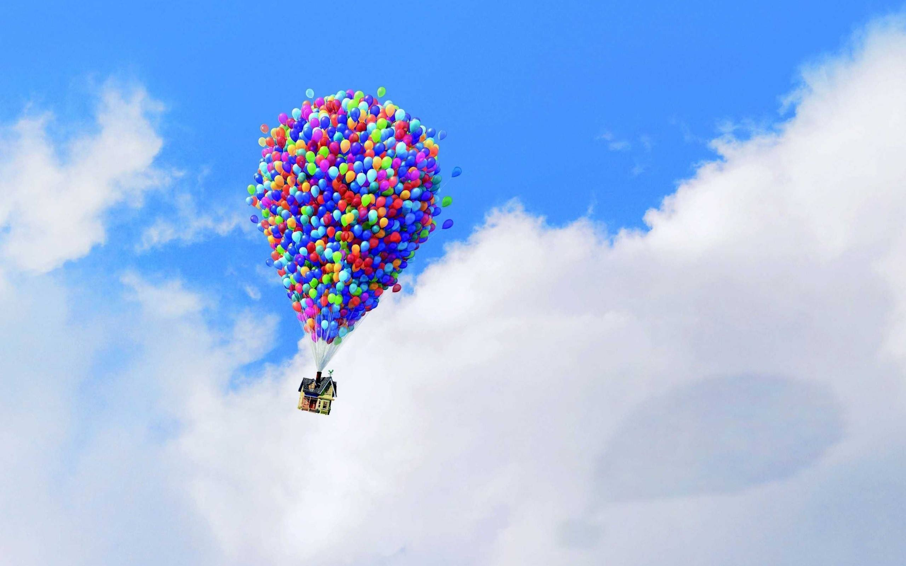
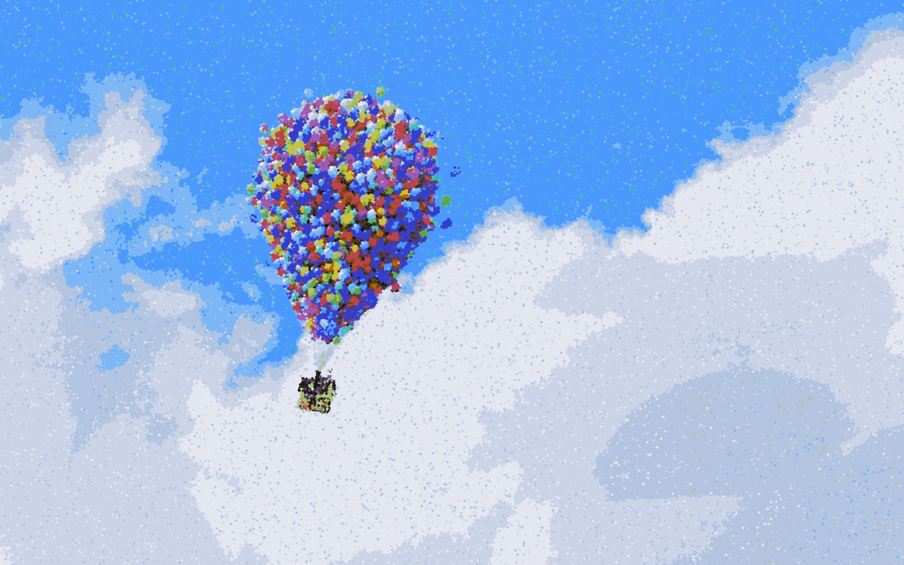

# Points_Art
Points_Art is a technique of painting in which small distinct dots of color are applied in patterns to form an image.

The art process is done in these steps:

<b> STEP 1 : Color Palette Creation </b>
  
 
Firstly we need to choose the set of colors that resembles the color of the original image given as input.This is done by 
running k-means and selecting the 10 dominating colors from the input image and then complementing the 10 dominant color to 
have a set of 20 colors. 

<b> STEP 2 : Final Processing </b>
 
  
Secondly, After having the set of colors we now have created randomised grid and then we shuffle it in order to have grid of 
random order. Finally the main part is to color each pixel such that it is almost similar to the original image. So here in 
order to carry out that we have computed probability of the similarities between the colors.

These are some of the results of our Project
### Input 

### Output
#### Without random variation

#### With random variation

### Tools used
- Jupyter
- OpenCV

### Steps to run the code
1. Take an input image
2. Use `pointilism.ipynb` to generate the image.

## Reference
<a href="https://web.stanford.edu/class/ee368/Project_Autumn_1516/Reports/Hong_Liu.pdf">
Create Pointillism Art from Digital Images </a>
